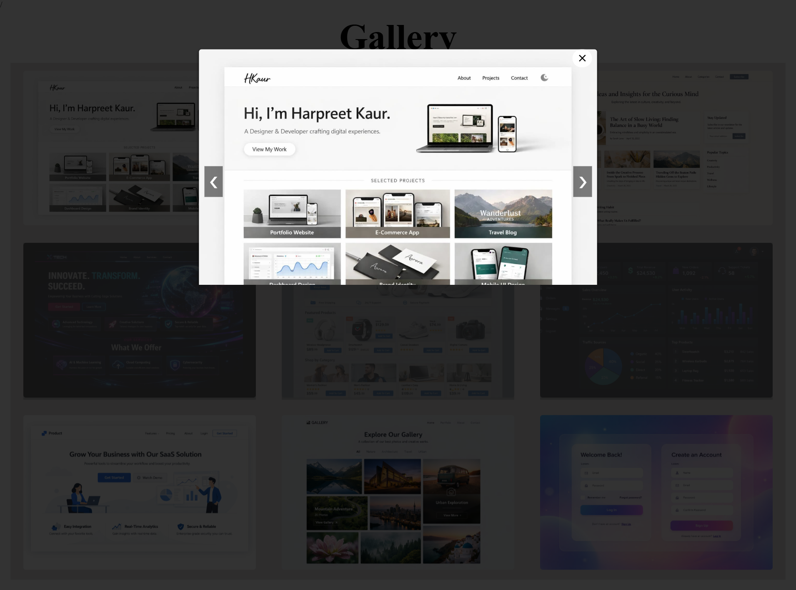

# 🖼️ Image Gallery with Lightbox

A responsive **Image Gallery Web App** built using **HTML, CSS, and JavaScript**.
This project showcases a modern gallery layout where users can view images and open them in a smooth **lightbox preview with navigation controls**.

The goal of this project was to focus on **UI presentation, interactivity, and clean user experience**.

---

## 🔗 Live Demo

https://js-lightbox-hkaur.vercel.app

---

## 📌 Features

* 🖼️ Responsive image gallery layout
* 🔍 Click to open image in **lightbox view**
* ⬅️➡️ Navigate between images
* ❌ Close button for easy exit
* 🌙 Dark overlay background for focus
* ⚡ Smooth and interactive user experience

---

## 🛠️ Tech Stack

* HTML
* CSS
* JavaScript

---

## 📷 Screenshot

---

## ⚙️ How It Works

* Images are displayed in a grid layout
* Clicking an image opens a **modal/lightbox**
* JavaScript handles:

  * Image switching (next/previous)
  * Opening and closing the modal
* A dark overlay keeps the user focused on the selected image

---

## 🙌 Note

This project was built as part of frontend practice to improve **JavaScript DOM manipulation and UI interaction skills**.

---
